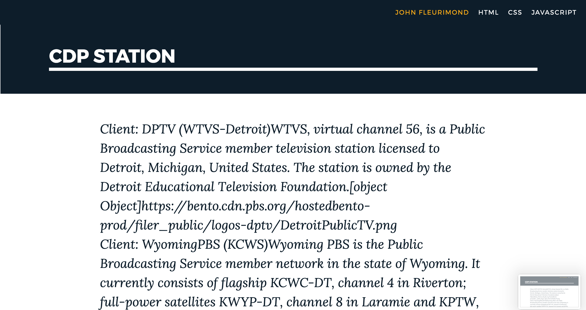

# :checkered_flag:What It Looks Like :checkered_flag:: 

Check it out here : https://johnfleurimond.github.io/cdp.github.io/

# My Awesome Project

# How It's Made:

## CSS~

## Javascript~

## Optimizations.

## Lessons Learned :mortar_board::

How to create GitHub pages.

## portfolio:

**WEBSITE:** https://johnfleurimond.com

## Installation

1. Clone repo
2. run `npm install`

## Usage

1. Right click on the `index.html` in file in the HTML folder.
2. Then right click and select the `Open in Browser`.

or 

3. Go to https://johnfleurimond.github.io/cdp.github.io/
